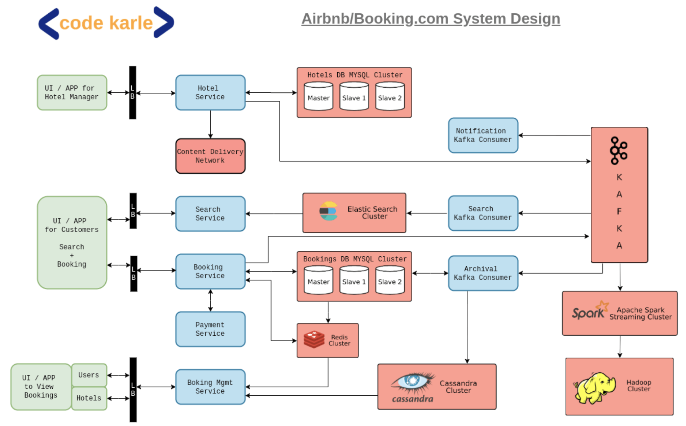
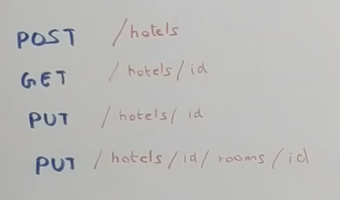
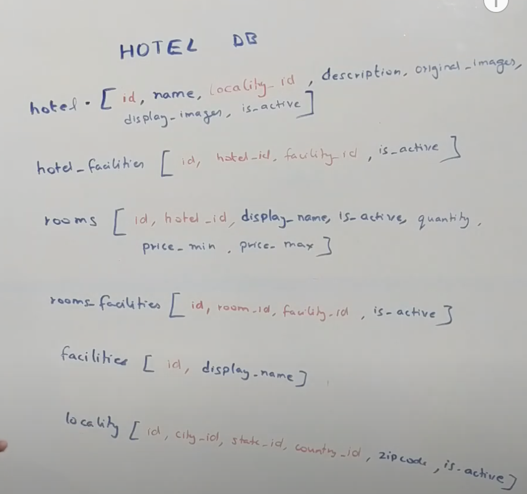
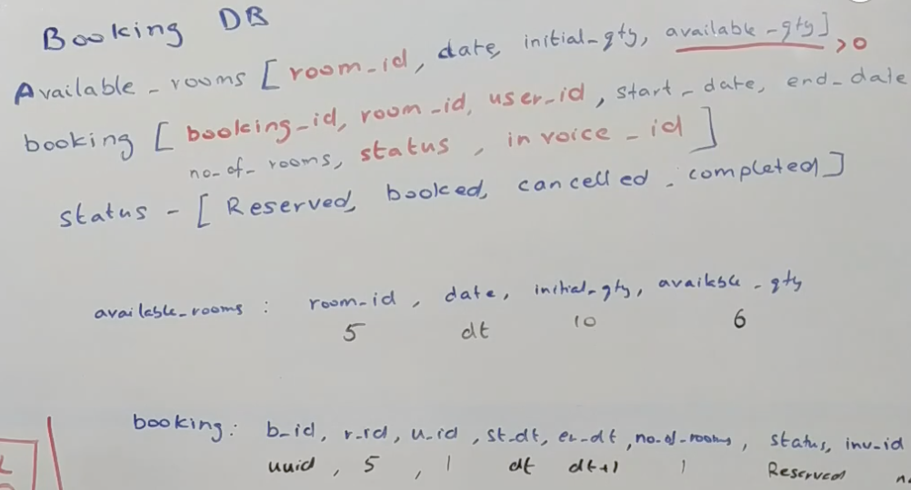
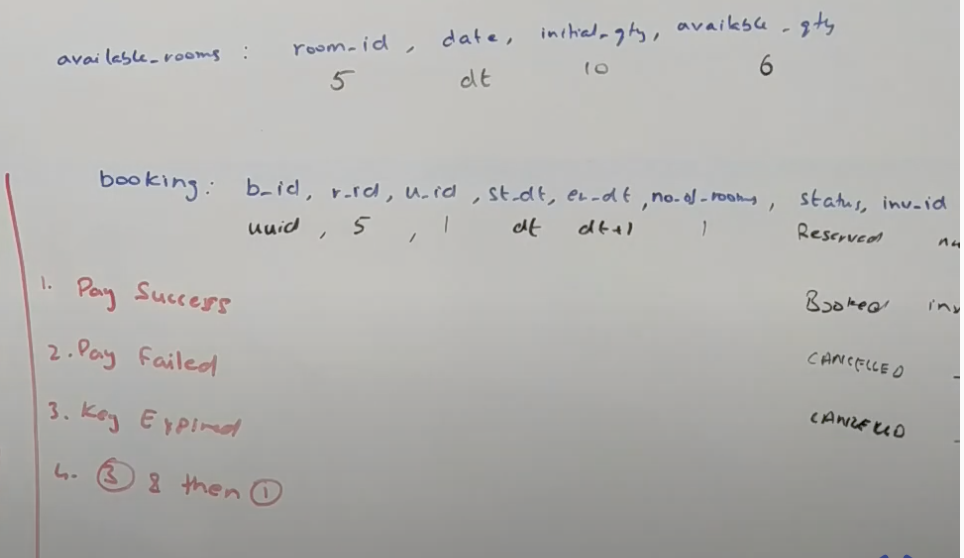

# Airbnb system design

## choosing best DB
https://www.codekarle.com/system-design/Database-system-design.html

## Functional requirements
- Hotel(provider)
    -    onboarding
    - updates
    - bookings
- User
    - search
    - book
    - check bookings
- Analytics

## Non- functional requirements
- Low latency
- High availability
- High consistency

## Flow diagram

## List of APIs

## Hotels DB

## Booking service
- POST/book

DB of booking service

steps for booking
 1) Check in available_rooms DB
 2) If user req matchs(means those many rooms available) insert row in bookins table and reduce the quantity in available_rooms DB
 3) Put in Redis with TTL
    a) when ever we start booking, we keep that booking id, with some expire time in redis.
    b) Redis has call back feature, so once the give time completes it notifies back.
    c) based on that we can terminate that booking and make that room available for other users.
    
4) if booking is good redirect to payment svc.
5) Finallay to kafka svc for notification.

## References
- https://www.youtube.com/watch?v=YyOXt2MEkv4
- https://github.com/codekarle/system-design/blob/master/system-design-prep-material/architecture-diagrams/Hoel%20Booking%20System.png